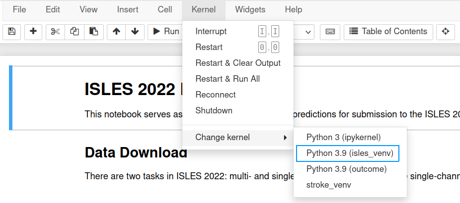

# ISLES 2022 - Getting Started
This repository provides detailed information for obtaining data associated with ISLES 2022, along with examples
of how to use BIDSIO to load batches and write out data in the format expected by the automatic evaluator.  

## Installation
The examples are provided in a [Jupyter Notebook](https://jupyter.org/) in this repo, called 
[ISLES_Example.ipynb](ISLES_Example.ipynb). If you've used Jupyter Notebooks before, you can install the packages
in `requirements.txt` and start the notebook. Otherwise, this section will walk you through first-time setup of 
the notebook.  
  
1. [Linux Installation](linux)
2. [MacOS Installation](macos)

### Linux <a name=linux></a>
We recommend that you use a Python virtual environment, for which you'll need the `python3.x-venv` package.
```bash
sudo apt-get install python3.9-venv
```
Next, create a virtual environment and source it:  
```bash
python3.9 -m venv isles_venv
source isles_venv/bin/activate
```
We'll now install the required packages via `pip`:
```bash
pip install --upgrade pip
pip install -r requirements.txt
```
We can now install the kernel to make it available to our Jupyter notebook:
```bash
python3.9 -m ipykernel install --user --name isles_venv --display-name "Python 3.9 (isles_venv)"
 ```
Start the notebook:
```bash
jupyter-notebook ISLES_Example.ipynb
```
In the menu bar near the top of the window, you'll see an option named `Kernel`. Under it, you can use `Change Kernel`
to select "Python 3.9 (isles_venv)": 


You should now be able to run the notebook. You can execute individual cells using `Shift` + `Enter`.

### MacOS <a name=macos></a>

First ensure that Python3 is installed on your system. See the [Python.org](https://www.python.org/downloads/macos/) 
release page for the installer. Open the terminal (Finder -> Applications -> Terminal). The following instructions are 
commands to be run through the terminal.

Create a directory to store files for the project:  
```bash
mkdir atlas2
cd atlas2
```

Create a virtual environment for the event, then source it.  
```bash
python3 -m venv isles_venv
source isles_venv/bin/activate
```

Download this repository:  
```bash
git clone https://github.com/npnl/isles_2022
```

We can now install the Python packages required by the notebook:
```bash
pip install --upgrade pip
pip install -r isles_2022/requirements.txt
```

Next, make the kernel available to the Jupyter notebook:
```bash
python3 -m ipykernel install --user --name isles_venv --display-name "Python 3 (isles_venv)"
```

Finally, start the notebook:
```bash
jupyter-notebook isles_2022/ISLES_Example.ipynb
```

You should now be able to run the notebook. You can execute individual cells using `Shift` + `Enter`.